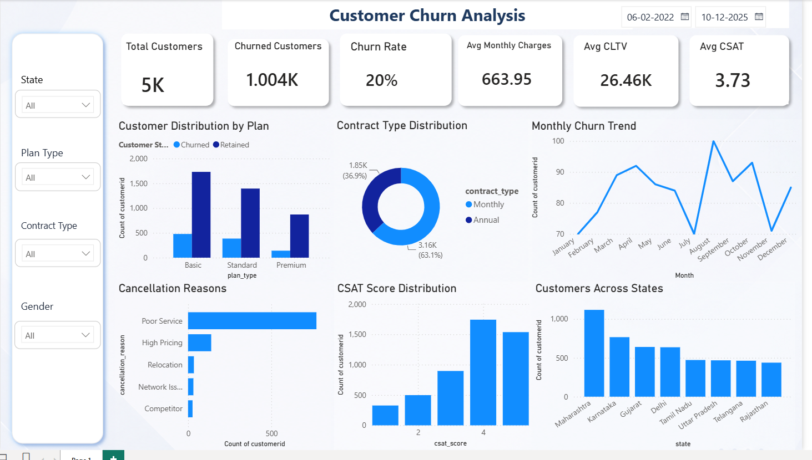

# 📊 Customer Churn Analysis using Python & Power BI

> **An end-to-end Business Intelligence project that analyzes customer churn patterns using Python and Power BI to uncover key churn drivers, build interactive dashboards, and deliver actionable business recommendations for improving customer retention and Customer Lifetime Value (CLTV).**

---

## 🚀 Project Highlights

- 📈 Analyzed **5,000 customer records** to identify churn patterns and customer behavior.
- 🐍 Performed **data cleaning, validation, and exploratory analysis** using Python, Pandas, and NumPy.
- 📊 Designed an **interactive Power BI dashboard** to monitor KPIs and customer segments.
- 💡 Identified the major drivers of customer churn, including customer satisfaction, complaints, escalations, contract type, and subscription plans.
- 📉 Delivered actionable business recommendations to improve customer retention and reduce revenue loss.
<p align="center">


# 📖 Project Overview

Customer retention is one of the most important drivers of long-term business profitability. While acquiring new customers often requires significant marketing investment, retaining existing customers improves recurring revenue, increases Customer Lifetime Value (CLTV), and reduces acquisition costs.

This project analyzes customer churn using Python for data preparation and exploratory analysis and Power BI for interactive business intelligence reporting. The objective is to identify the primary factors contributing to customer churn and translate analytical findings into actionable business recommendations.

Rather than focusing only on visualization, this project follows a complete analytics workflow—from data cleaning and validation to dashboard development and executive-level business insights. The resulting dashboard enables stakeholders to monitor key performance indicators (KPIs), identify high-risk customer segments, and make informed retention decisions.


</p>


# 🎯 Business Problem

Customer churn is one of the biggest challenges for subscription-based businesses because losing existing customers directly impacts recurring revenue, customer lifetime value (CLTV), and overall profitability. Acquiring new customers is significantly more expensive than retaining existing ones, making customer retention a strategic business priority.

Despite having access to customer data, organizations often struggle to proactively identify customers who are at risk of leaving. Without a data-driven retention strategy, businesses react only after customers have already churned, resulting in lost revenue and missed growth opportunities.

This project addresses that challenge by analyzing customer behavior, identifying the primary drivers of churn, and building an interactive Power BI dashboard that enables business stakeholders to monitor customer health, detect high-risk segments, and make informed retention decisions.

# 🎯 Project Objectives

The primary objectives of this project are:

- Analyze customer behavior using historical data.
- Measure and understand customer churn patterns.
- Identify the key factors influencing customer churn.
- Perform data cleaning, validation, and exploratory data analysis using Python.
- Build an interactive Power BI dashboard for business stakeholders.
- Monitor key business KPIs related to customer retention.
- Generate actionable business insights from customer data.
- Recommend data-driven strategies to improve customer retention and customer lifetime value (CLTV).

# 🛠️ Tech Stack

| Category | Technologies |
|----------|--------------|
| Programming Language | Python |
| Data Analysis | Pandas, NumPy |
| Data Visualization | Matplotlib, Seaborn |
| Business Intelligence | Power BI |
| Data Modeling | DAX |
| Development Environment | Jupyter Notebook, VS Code |
| Version Control | Git & GitHub |

# 📂 Dataset Overview

The project uses a simulated customer churn dataset representing a subscription-based business. The dataset contains customer demographics, subscription details, service usage, support interactions, and customer satisfaction metrics that influence churn behavior.

### Dataset Summary

| Attribute | Details |
|-----------|----------|
| Dataset | Customer Churn Dataset |
| Total Records | 5,000 |
| Target Variable | Churn |
| Industry | Subscription-Based Business / Telecom / SaaS |
| File Format | CSV |

### Key Features

- Customer ID
- Gender
- Age
- Tenure
- Plan Type
- Contract Type
- Monthly Charges
- Customer Lifetime Value (CLTV)
- Customer Satisfaction Score (CSAT)
- Complaints
- Escalations
- Payment Method
- Churn Score

# 🔄 Project Workflow

```text
Business Problem
        │
        ▼
Data Collection
        │
        ▼
Data Validation
        │
        ▼
Data Cleaning
        │
        ▼
Feature Engineering
        │
        ▼
Exploratory Data Analysis (EDA)
        │
        ▼
Power BI Dashboard Development
        │
        ▼
Business Insights
        │
        ▼
Strategic Recommendations
```

# 📁 Repository Structure

```text
customer-churn-analysis/
│
├── dashboard/
│   └── churn_analysis_dashboard.pbix
│
├── data/
│   └── customer_churn_5000.csv
│
├── notebooks/
│   ├── 01_data_validation.ipynb
│   └── 02_exploratory_data_analysis.ipynb
│
├── images/
│
├── README.md
├── requirements.txt
└── LICENSE
```

# 📊 Dashboard Preview

The Power BI dashboard was designed as an executive decision-support tool, enabling business stakeholders to monitor customer churn, analyze customer behavior, and identify high-risk segments through interactive visualizations.

## 📊 Dashboard Preview



### Dashboard Features

- 📈 Executive KPI Cards
- 🎯 Customer Churn Analysis
- 📊 Contract Type Analysis
- 💳 Subscription Plan Analysis
- 😊 Customer Satisfaction Trends
- 📞 Complaint & Escalation Analysis
- 💰 Customer Lifetime Value Analysis
- 🎛️ Interactive Filters & Slicers

# 📌 Key Performance Indicators (KPIs)

The dashboard monitors the following business KPIs to evaluate customer retention performance.

| KPI | Business Purpose |
|------|------------------|
| 👥 Total Customers | Total number of customers in the dataset |
| 🚪 Churn Rate | Percentage of customers who left the service |
| 💰 Average Customer Lifetime Value | Measures long-term customer profitability |
| 😊 Customer Satisfaction Score | Indicates customer experience quality |
| 📞 Complaint Count | Tracks customer service issues |
| ⚠️ Escalation Count | Measures unresolved customer problems |
| 💳 Contract Type Distribution | Compares Monthly vs Annual customers |
| ⭐ Subscription Plan Distribution | Analyzes customer plan preferences |

# 💡 Key Business Insights

The analysis uncovered several important business insights that directly influence customer retention and long-term profitability.

## 📉 1. Monthly Contract Customers Have Higher Churn

Customers subscribed to monthly contracts exhibit significantly higher churn rates compared to annual subscribers. This indicates that long-term contracts strengthen customer commitment and improve retention.

---

## ⭐ 2. Premium Customers Show Better Retention

Premium plan subscribers demonstrate the lowest churn rate among all subscription plans, suggesting that higher perceived value contributes to stronger customer loyalty.

---

## 😊 3. Customer Satisfaction Is the Strongest Retention Driver

Customers with low satisfaction scores are substantially more likely to churn. Improving customer experience represents one of the highest-impact opportunities for reducing churn.

---

## 📞 4. Complaints Strongly Increase Churn Risk

Customers with multiple service complaints are considerably more likely to leave the organization, highlighting the importance of proactive issue resolution.

---

## ⚠️ 5. Escalated Support Cases Lead to Higher Customer Loss

Repeated service escalations indicate unresolved customer issues and correlate strongly with increased churn probability.

---

## 💰 6. Active Customers Generate Higher Customer Lifetime Value

Retained customers contribute significantly greater long-term business value compared to churned customers, reinforcing the financial importance of customer retention initiatives.

---

## 📊 7. Customer Experience Matters More Than Pricing

The analysis indicates that customer experience factors—including satisfaction, complaints, and service quality—have a stronger influence on churn than monthly subscription charges.

# 🚀 Business Recommendations

Based on the findings from this analysis, the following strategic recommendations are proposed to improve customer retention and business performance.

### ✅ Promote Annual Subscription Plans

Encourage customers to transition from monthly to annual contracts through targeted incentives and loyalty programs.

---

### ✅ Improve Customer Satisfaction

Implement continuous monitoring of customer satisfaction scores and proactively engage customers displaying signs of dissatisfaction.

---

### ✅ Resolve Customer Complaints Faster

Prioritize complaint resolution and reduce support response times to minimize customer frustration.

---

### ✅ Reduce Escalations

Introduce service quality improvements and early intervention strategies to prevent repeated support escalations.

---

### ✅ Build a Churn Prediction System

Develop a predictive analytics model to identify high-risk customers before they decide to leave.

---

### ✅ Launch Targeted Retention Campaigns

Use customer segmentation to deliver personalized offers and retention strategies tailored to different customer groups.

---

### ✅ Increase Premium Plan Adoption

Promote premium subscription plans by emphasizing their value proposition and long-term benefits to eligible customers.

# 📈 Business Impact

This project demonstrates how data analytics and business intelligence can support strategic decision-making by transforming raw customer data into actionable insights.

The developed dashboard enables stakeholders to:

- Monitor customer churn trends.
- Identify high-risk customer segments.
- Measure customer satisfaction and service quality.
- Track key business KPIs.
- Support proactive customer retention strategies.
- Improve customer lifetime value (CLTV).
- Enhance data-driven decision-making across the organization.
